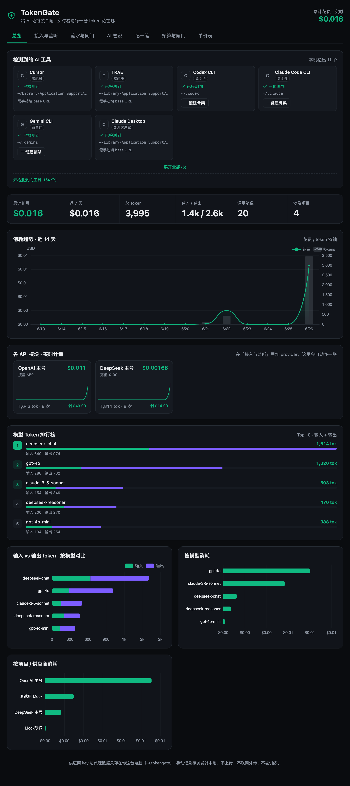
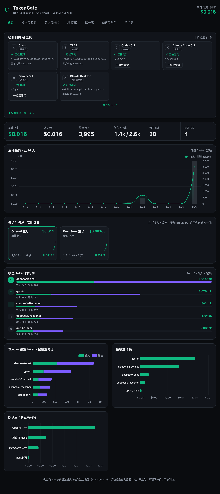
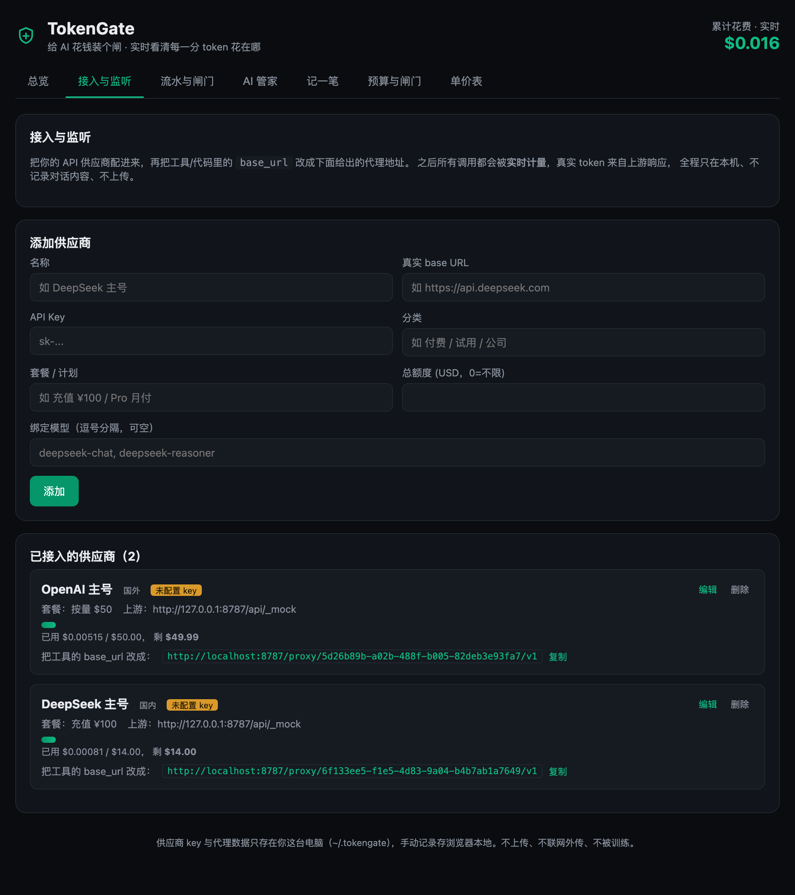
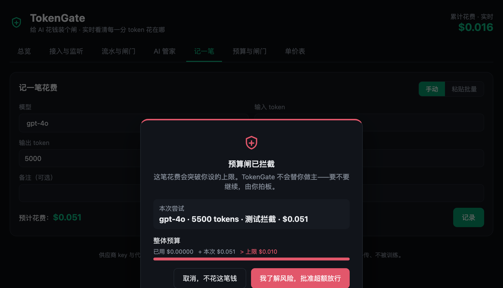
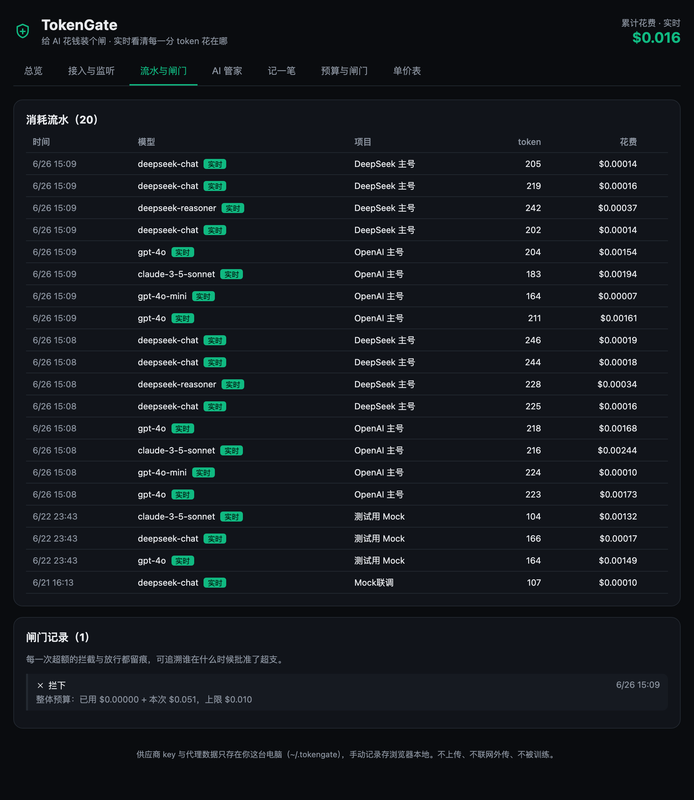
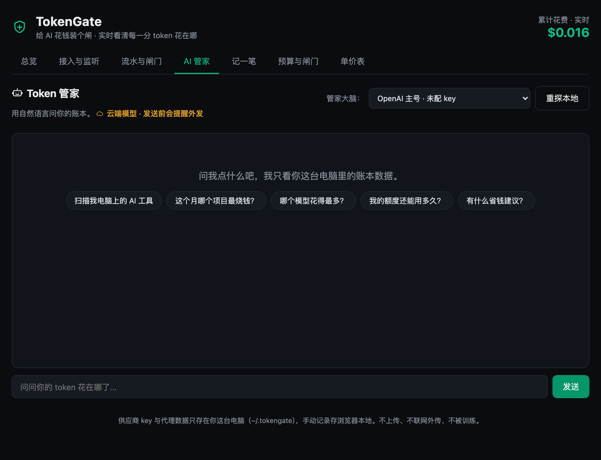

# TokenGate

> 给 AI 花钱装个闸 — 本机运行的 token 消耗管家

AI 帮你干活,但花的是你的钱。TokenGate 让你看清每一分 token 花在哪里、给谁花、还剩多少额度,并能在它打算继续花钱之前**先问过你**才放行。

**完全本地、不联网、不上传任何数据**。可同时接入国内外几十家大模型 API。

---

## 📸 产品截图

| | |
|---|---|
|  |  |
| **驾驶舱总览** · 工具扫描 + 指标带 + 14 天大图 | **模块化 Provider + 模型 Token 排行榜** |
|  |  |
| **接入与监听** · 代理地址 + 一键复制 | **灵魂功能:预算闸拦截弹窗** |
|  |  |
| **流水 + 闸门留痕** | **AI 管家** · 本地优先 / 云端确认 |

---

## ✨ 它能做什么

- **可视化驾驶舱**:近 14 天消耗趋势、按模型/项目分布、输入/输出 token 对比、模型 token 排行榜
- **代理监听**:把任何 OpenAI 兼容工具的 `base_url` 指过来,自动捕获真实 token 用量,**零侵入**
- **预算闸 + 超额拦截 + 人工放行**:你立法、闸门拦截、必须你点确认才能突破预算。每次拦截都留痕
- **多供应商额度账户**:充值 ¥100 自动扣减,余额低于预警线高亮,不用再上各家网站查
- **AI 管家**:用你本地的大模型(Ollama / MLX / LM Studio 等)问账本,云端模型必须弹窗确认才外发
- **AI 工具扫描**:一键扫描你 Mac 上的 65 种 AI 工具(IDE/CLI/GUI/本地推理),自动建 provider 骨架
- **双币种单价表**:国内模型 ¥/M、国外模型 $/M,自动按汇率换算成 USD 统一入账

---

## 🚀 启动方式

需要 Node.js ≥ 20。

```bash
cd tokengate
npm install
npm start
```

然后浏览器打开 **http://localhost:5173/**。

`npm start` 会同时拉起:
- 前端 (Vite, 5173)
- 后端代理 + API (Express, 8787)

数据存储:`~/.tokengate/state.json` (仅本机,不上传)。

---

## 🎬 30 秒上手 (Mock 演示)

不需要任何 API key、不需要联网,也能完整跑一遍闭环:

1. 打开「接入与监听」→ 添加 provider:
   - 名称:`Mock 联调`
   - baseUrl:`http://127.0.0.1:8787/api/_mock`
   - 套餐:`本地演示`、额度:`5`、模型:`mock-model`
2. 复制卡片上的代理地址(形如 `http://127.0.0.1:8787/proxy/<id>/v1`)
3. 在终端 curl 它:
   ```bash
   curl -X POST http://127.0.0.1:8787/proxy/<id>/v1/chat/completions \
     -H 'Content-Type: application/json' \
     -d '{"model":"gpt-4o","messages":[{"role":"user","content":"测试一下"}]}'
   ```
4. 回首页「总览」,所有图表实时跳数;「流水与闸门」可看每笔捕获记录

---

## 🔌 接真实 API

任何兼容 OpenAI 协议的服务都能接(DeepSeek / Kimi / 通义 / 智谱 / 豆包 / OpenAI / Claude / Gemini …):

1. 「接入与监听」→ 添加 provider,填真实 `baseUrl` + `API Key`
2. 保存的瞬间会自动 ping 上游验证 key (`/v1/models`,零 token 消耗)
3. 把你的 AI 工具 `base_url` 改成 TokenGate 给的代理地址,API key 随便填(代理会用真 key 替换)
4. 之后所有调用经过代理,实时计量、自动入账

---

## 🧭 主要标签页

| 标签 | 用途 |
|---|---|
| **总览** | 驾驶舱视图:工具扫描 + 6 指标带 + 14 天趋势 + 各 API 模块化卡 + 排行榜 |
| **接入与监听** | 增删改 provider,自动测试连通性,显示代理地址 |
| **流水与闸门** | 每笔消耗的明细 + 每次预算拦截/放行的留痕 |
| **AI 管家** | 本地大模型问账本(数据不出门),云端模型外发前必须确认 |
| **记一笔** | 手动录入(批量粘贴支持) |
| **预算与闸门** | 整体/按模型/按项目设上限 |
| **单价表** | 国内 ¥/M、国外 $/M 两张表 |

---

## 🛡️ 隐私承诺

- 不读 API key、不读对话历史、不读任何文件内容
- AI 工具扫描**只看目录名是否存在**,绝不进文件
- AI 管家给模型的上下文是只读账本快照(花费/模型/额度汇总),不含任何隐私
- 所有数据存 `~/.tokengate/state.json`,可随时 `rm` 清空
- 后端只绑 `127.0.0.1`,不对外暴露

---

## 🏗️ 技术栈

- 前端:Vite + React 19 + TypeScript + ECharts
- 后端:Express 5 + tsx watch (热重载)
- 主题:taste-skill 驾驶舱规范、Emerald 单色强调、SVG 图标(零 emoji)

---

## 📜 许可

参赛/演示作品,不对外承诺兼容性。自用随便改。
