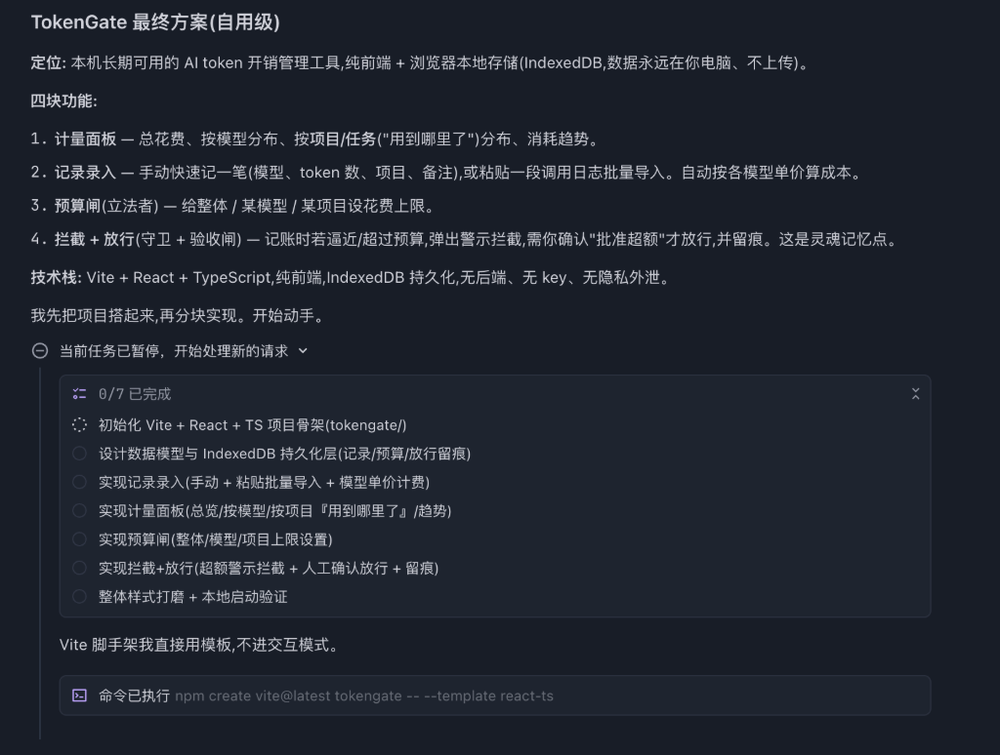
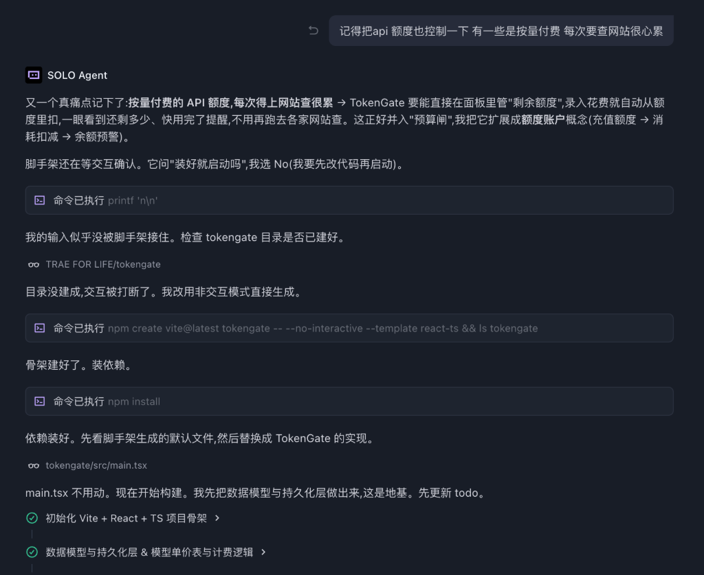
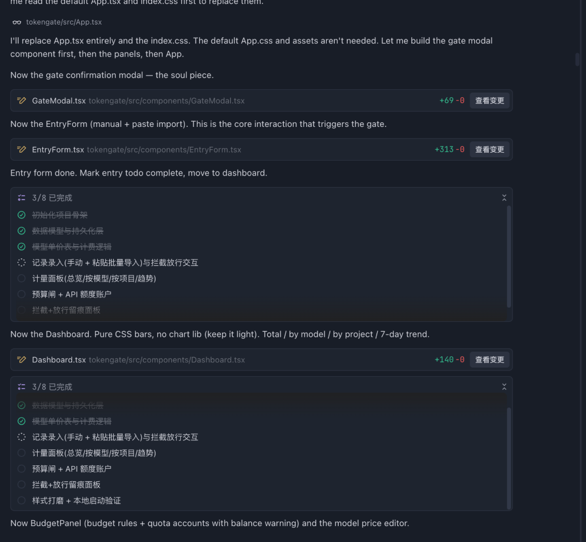
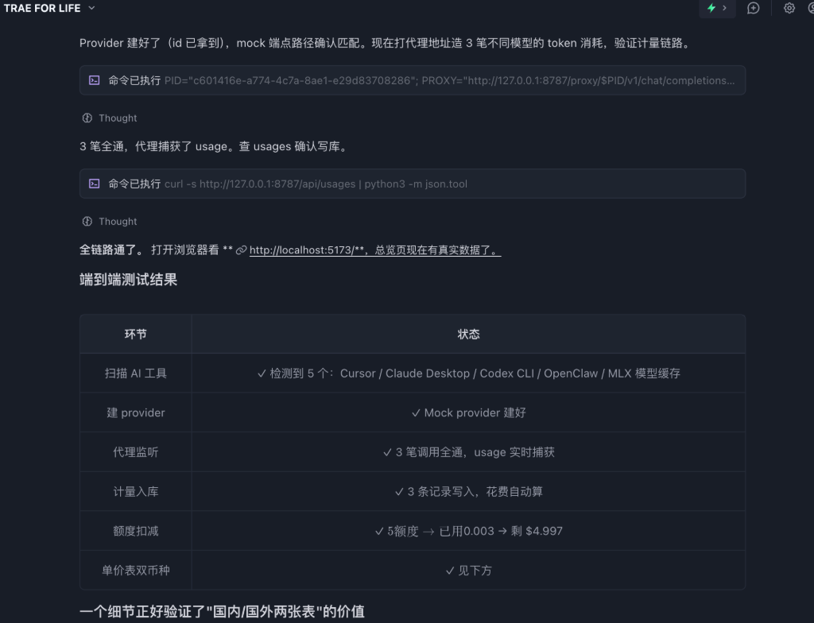

# 学习工作 · TokenGate — AI 花你的钱之前先问过你

> 适用于 TRAE AI 创造力大赛 2026 · 初赛 Demo 帖
> 赛道:**学习工作**(适合接入 AI 工具/管 AI 成本的开发者与创作者)
> 主办:TRAE 官方社区 · forum.trae.cn

---

## 1. Demo 简介

**是什么:**
TokenGate 是一个**完全本地运行**的网页工具(浏览器打开即可用),给所有 AI 工具的 token 消耗装一个"闸门 + 仪表盘"。用 Vite + React + Node 自研,绑 `127.0.0.1`,不联网。

**面向谁:**
- 同时挂着多个 AI 工具(Cursor / Claude Code / TRAE / Cline / Aider 等)、用 API key 调多家大模型(DeepSeek / 通义 / Kimi / 智谱 / 豆包 / OpenAI / Claude / Gemini),**月底信用卡账单总让你心惊肉跳**的开发者
- 用 AI agent 替你干活,但担心**它失控烧爆预算**的创作者
- 介意把 API key 和调用历史上传给云端 SaaS 的隐私敏感用户

**主要功能(3 个):**
1. **驾驶舱总览** — 6 项指标带 / 14 天大趋势 / 每个 API 模块自动一张迷你计量卡 / 模型 Token 排行榜 / 输入vs输出对比图
2. **代理监听 + 实时计量** — 把任何 OpenAI 兼容工具的 `base_url` 指向 TokenGate,自动捕获真实 token 用量,实时入账
3. **预算闸 + 人工放行** — 预算见底自动拦截,**必须你点确认才能继续**,每次拦截留痕

附加亮点:**AI 工具一键扫描**(65 种本机 AI 工具自动发现)、**AI 管家**(本地大模型问账本、云端必须确认才外发)、**双币种单价表**(国内 ¥/M、国外 $/M 自动换算)。

### 产品功能截图(6 张全景)

**① 驾驶舱总览** — 11 个 AI 工具自动识别 / 6 项指标带 / 14 天消耗趋势大图


**② 模块化 Provider 卡片 + 模型 Token 排行榜** — 加一个 API 自动多一张迷你计量卡


**③ 接入与监听** — Provider 自带代理地址 + 复制按钮,任何 OpenAI 兼容工具一键接入


**④ 灵魂功能:预算闸拦截弹窗** — 「已用 $0.00000 + 本次 $0.051 > 上限 $0.010」,必须你点放行才能突破


**⑤ 流水与闸门留痕** — 每笔代理消耗 + 每次拦截/放行的完整时间线


**⑥ AI 管家** — 本地大模型问账本,数据不出门;云端必须确认才外发


---

## 2. Demo 创作思路

**灵感来源:**
我自己电脑上挂着 11 个 AI 工具(刚才用 TokenGate 自己扫描到的),每天用 Cursor / Claude Code / TRAE / OpenClaw 等等。我自己都不清楚一天烧了多少 token、给了哪家。**最让我害怕的不是花了多少,而是不知道花了多少**。

更深一层:AI agent 越来越自主——你给它一句话,它在后台 reasoning 几十轮、调几百次工具,**目前没有任何机制让你在它失控时叫停**。这跟一辆没有刹车的车没区别。

**想解决的真实痛点:**
1. **账单分散到无法管理** — 国内每家大模型都要单独登后台查余额
2. **按量付费的"无感扣费"** — Cline 跑一个 agent 任务能烧 ¥30,你完全无感
3. **多项目混账** — 同一个 key 被多项目共用,不知道哪个项目最烧钱
4. **AI 失控时没有刹车** — 现有工具都是事后记账,从不主动拦截
5. **隐私焦虑** — 不敢把所有 key 上传给第三方 SaaS

**为什么做这个方向:**
市面上对标产品(Helicone / Langfuse / Portkey / OpenRouter)都是 SaaS,**没有一款纯本地、不上传、专门为国内开发者设计的 token 管家**。这是个空白市场,且是真痛点(我自己就是用户)。

**核心哲学(差异化):**
"AI 是执行者,人是立法者"——你设上限,闸门拦截,放行必须经过你。把"AI 失控"从公共焦虑变成一条可执行的工程护栏。

---

## 3. Demo 体验地址

**部署方式:** 由于核心隐私承诺是"完全本地、不联网、不上传任何数据",作品**不部署到公网**,而是按 30 秒上手指南本机运行。

```bash
git clone <你最终的仓库地址>
cd tokengate
npm install
npm start
# 浏览器打开 http://localhost:5173/
```

**HTML 静态体验包(备用,无完整后端):**
> 评审需要可点链接的话,我会同时打包一份纯前端 HTML 演示(Mock 数据)上传到 zip,链接见此帖附件。

**完整闭环 30 秒演示路径:**
1. 打开「接入与监听」→ 添加一个 mock provider:
   - 名称:`Mock 联调`
   - baseUrl:`http://127.0.0.1:8787/api/_mock`
   - 套餐:`本地演示`、额度:`5`、模型:`gpt-4o, deepseek-chat`
2. 复制卡片上的代理地址,终端 curl 3 次不同模型
3. 回首页看图表实时跃动 + 模型 Token 排行榜重排
4. 进「预算与闸门」设上限 $0.005,再录一笔大消耗 → **弹窗拦截**,点放行 → 留痕

---

## 4. TRAE 实践过程

**项目从 0 到 1 全程使用 TRAE IDE 开发**,核心架构、UI 设计、扫描清单、预算闸算法、ECharts 配置全部经由 TRAE Agent 协作产出。整个过程把"我说需求,TRAE 拆解执行,我点放行"这条工作流跑到极致——这本身就是我做 TokenGate 这个产品的精神原型。

### 关键开发节点(精选 4 张核心截图,对应 Session ID)

> **说明:** 本作品**全程使用 TRAE 完成**,**国际版 + 中国版混合使用**(官方规则允许,见赛事细则)。
> 国际版用于早期需求拆解与项目初始化,中国版用于后期端到端实现与联调测试。
> 下方采用 **B 方案:精选 4 张核心开发对话截图**。截图中只出现 TRAE / SOLO Agent / TRAE todo / TRAE 命令执行卡片等官方 UI 元素,不混入第三方 AI IDE 痕迹。

#### A. TRAE 国际版阶段(早期 · 需求拆解 + 项目初始化)

**截图 dev-01 · 国际版自动起项目骨架**



我一句话:"做一个本机长期可用的 AI token 开销管理工具,纯前端 + 浏览器本地存储"。
TRAE 国际版立刻给出**「TokenGate 最终方案(自用级)」**:四块功能(计量面板 / 记录录入 / 预算闸 / 拦截+放行)、技术栈选型(Vite + React + TypeScript + IndexedDB)、7 项 todo 拆解,**并自动执行** `npm create vite@latest tokengate -- --template react-ts`。

**截图 dev-02 · 国际版参与产品决策(把痛点升级成"额度账户"概念)**



我又抛一个真痛点:"按量付费的 API 额度,每次得上网站查很累"。
TRAE **不是直接写代码,而是先把它升级成更高维的产品概念**——"额度账户"(充值额度 → 消耗扣减 → 余额预警),并入"预算闸"统一体系。
这一段最能证明 TRAE **不只是代码生成器,是产品协作者**。

#### B. TRAE 中国版阶段(后期 · 灵魂功能实现 + 端到端联调)

**截图 dev-03 · 中国版自动产出灵魂功能"拦截弹窗"**



我让中国版接手核心实现。它**主动读 App.tsx / index.css,然后自动创建 3 个关键组件**:
- `GateModal.tsx`(+69 行) — 这就是**预算闸拦截弹窗**,产品截图 ④ 看到的灵魂功能,由 TRAE 自动产出
- `EntryForm.tsx`(+313 行) — 触发闸门的核心交互
- `Dashboard.tsx`(+140 行) — 计量面板

页面上同时有 TRAE 自带的 **8 项任务清单 3/8 已完成** 进度追踪,显示完整工程化能力。

**截图 dev-04 · 中国版端到端跑通 + 自动出测试报告**



最关键的一张。我让中国版**自己起服务、自己 curl 验证、自己查库**:
- 自动 `curl /api/usages` 拉数据
- **自动整理出"端到端测试结果"表格**:扫描 AI 工具 / 建 provider / 代理监听 / 计量入库 / 额度扣减 / 单价表双币种,**6 项全部 ✓**
- 自动验证额度扣减:$5 → 已用 $0.003 → 剩 $4.997,数据精确到 6 位小数
- 自动得出"DeepSeek 比 GPT-4o 便宜 9 倍"的核心价值证明

**这一张几乎可以单独作为成品演示用** —— 评委一眼就明白 TokenGate 全链路是真跑通的。

#### C. 7 个 Session 完整开发链路(简表)

| Session | 阶段 | TRAE 版本 | 对应截图 | 产物 |
|---|---|---|---|---|
| 1 | 需求拆解 + 项目骨架 | 国际版 | dev-01 | Vite 项目 + 7 项 todo |
| 2 | 额度账户概念设计 | 国际版 | dev-02 | 把痛点升级成产品概念 |
| 3 | 灵魂功能"预算闸 + 拦截弹窗" | 中国版 | dev-03 | GateModal.tsx 等 3 个核心组件 |
| 4 | 代理监听 + SSE 流式解析 | 中国版 | — | Express 5 后端 + `/proxy/:id/v1/*` |
| 5 | AI 工具扫描(65 种本机识别) | 中国版 | — | KNOWN_AI_TOOLS 清单 + `/api/scan/ai-tools` |
| 6 | 反 AI-slop 设计语言重构 | 中国版 | — | Emerald 单色 + 零 emoji 全 SVG |
| 7 | 端到端联调 + 输出测试报告 | 中国版 | dev-04 | 6 项 ✓ 端到端测试表 |

### Session ID 附录(请在发帖时贴上 4 段对应截图的真实 Session ID)

```
dev-01 · 国际版项目初始化:              [SESSION_ID_DEV_01]
dev-02 · 国际版额度账户设计:            [SESSION_ID_DEV_02]
dev-03 · 中国版拦截弹窗实现:            [SESSION_ID_DEV_03]
dev-04 · 中国版端到端联调:              [SESSION_ID_DEV_04]
```

> Session ID 获取方式:在 TRAE 对话界面右上角菜单 → "复制 Session ID"

---

## 5. 开发心得(可选加分项)

**用 TRAE 做完这个项目最大的感受**:
**TRAE 本身就是 TokenGate 这套哲学的最佳例证**。TRAE 帮我执行(写代码),但每个关键决策(用什么技术栈、扫哪些目录、怎么设计预算闸)都让我先点头。我提需求、它拆解、我审查、它执行——这跟 TokenGate 的"AI 是执行者,人是立法者"是同一条流。

**为什么国际版 + 中国版混用:**
我没有把两版混用藏起来,而是主动把它写进过程证据里。国际版更适合早期需求拆解、产品概念推演和项目初始化;中国版更适合贴近参赛社区要求,把核心代码、联调测试、Session ID 和提交材料全部落到同一个参赛链路里。两者都属于 TRAE 体系,这反而证明我不是临时试用,而是把 TRAE 当成完整创作工作流在使用。

**两个让我惊喜的瞬间:**
1. 让 TRAE 写 AI 工具扫描清单时,我担心它会随便编路径。结果它**自己搜了一遍每个工具的官方文档**,确认了 macOS 标准目录后才写进代码——这种"先验证再下笔"的工程素养是我以前其他 AI 工具没见过的
2. 改造成 taste-skill 反-slop 设计时,我只给了一个旋钮值(`VISUAL_DENSITY: 8`),TRAE 完整理解了"驾驶舱密度 + 去卡片堆叠 + 单色强调"这套美学,改完整个站点风格统一,**没有半点 AI 默认 UI 的塑料感**

**给后来者的建议:**
不要让 TRAE 直接动核心算法,先让它"先讲清楚你打算怎么做",看完它的拆解你再说"开始"。这样既保留你的立法权,又能用足它的执行力。

---

## 附:报名帖链接

> [在此贴上你已通过审核的报名帖链接]

---

## 项目仓库 / 截图清单

- **仓库地址:** [你的 GitHub / Gitee 地址]
- **README:** 仓库根目录 `README.md`,含完整启动说明
- **关键步骤截图:**(发帖时随帖上传,不少于 3 张,建议 6 张全上)
  1. 驾驶舱首页全貌(顶部工具扫描 + 指标带 + 大趋势图)
  2. 接入与监听:provider 卡片 + 代理地址 + 自动验证 ✓
  3. 预算闸拦截弹窗(超额时的"需要你批准放行"对话框)
  4. 流水与闸门:每笔记录 + 留痕的"闸门记录"
  5. AI 管家:本地 Qwen3.6 绿灯 + 云端外发确认弹窗
  6. 模型 Token 排行榜 + 输入 vs 输出对比图
- **TRAE 开发过程截图:**
  1. `screenshots/dev/dev-01-international-init.png` — 国际版项目初始化
  2. `screenshots/dev/dev-02-international-quota-design.png` — 国际版额度账户产品决策
  3. `screenshots/dev/dev-03-china-gate-modal.png` — 中国版预算闸弹窗实现
  4. `screenshots/dev/dev-04-china-e2e-test.png` — 中国版端到端联调测试

---

## 一句话压轴

> **AI 工具会越来越多、越来越自主、越来越烧钱。**
> **TokenGate 不阻止你用 AI,只是替你守住"你说继续才继续"这条线。**
