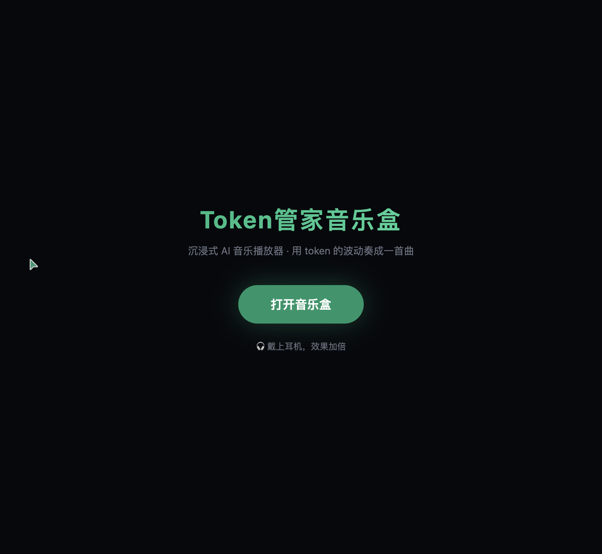
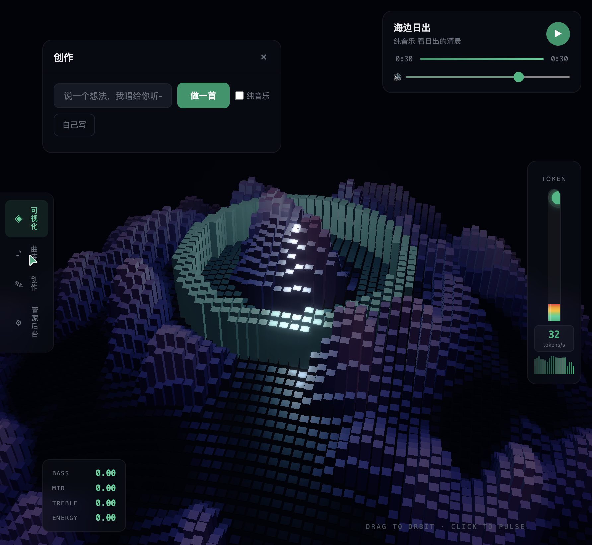
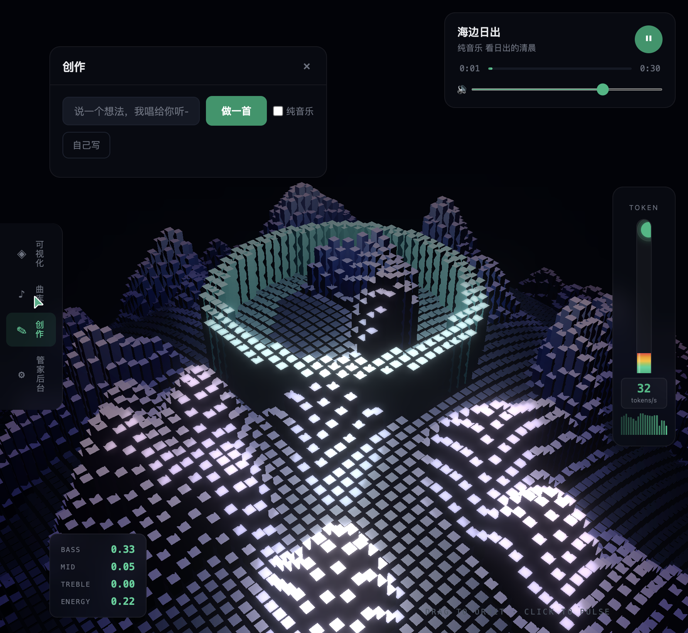

# 学习工作 · TokenGate — AI 花你的钱之前先问过你

> 适用于 TRAE AI 创造力大赛 2026 · 初赛 Demo 帖
> 赛道:**学习工作**(适合接入 AI 工具/管 AI 成本的开发者与创作者)
> 主办:TRAE 官方社区 · forum.trae.cn
>
> **进度:** ✅ 报名帖已通过审核(月卡已到账) · 🛠️ 初赛 Demo 打磨中 · ⏳ **7 月 15 日**前提交初赛

---

## 1. Demo 简介

**是什么:**
TokenGate 是一个**完全本地运行**的网页工具(浏览器打开即可用),给所有 AI 工具的 token 消耗装一个"闸门 + 仪表盘"。用 Vite + React + Node 自研,绑 `127.0.0.1`,不联网。

**面向谁:**
- 同时挂着多个 AI 工具(Cursor / Claude Code / TRAE / Cline / Aider 等)、用 API key 调多家大模型(DeepSeek / 通义 / Kimi / 智谱 / 豆包 / OpenAI / Claude / Gemini),**月底信用卡账单总让你心惊肉跳**的开发者
- 用 AI agent 替你干活,但担心**它失控烧爆预算**的创作者
- 介意把 API key 和调用历史上传给云端 SaaS 的隐私敏感用户

**主要功能(3 个):**
1. **驾驶舱总览** — 6 项指标带 / 14 天大趋势 / 每个 API 模块自动一张迷你计量卡 / 模型 Token 排行榜 / 输入vs输出对比图
2. **代理监听 + 实时计量** — 把任何 OpenAI 兼容工具的 `base_url` 指向 TokenGate,自动捕获真实 token 用量,实时入账
3. **预算闸 + 人工放行** — 预算见底自动拦截,**必须你点确认才能继续**,每次拦截留痕

附加亮点:**AI 工具一键扫描**(65 种本机 AI 工具自动发现)、**AI 管家**(本地大模型问账本、云端必须确认才外发)、**双币种单价表**(国内 ¥/M、国外 $/M 自动换算)、**🎵 Token管家音乐盒**(AI 自动写词谱曲 + 8100 体素随音频起伏 + Token 水银柱可视化)。

### 产品功能截图(6 张全景 + 3 张音乐盒)

**① 驾驶舱总览** — 11 个 AI 工具自动识别 / 6 项指标带 / 14 天消耗趋势大图


**② 模块化 Provider 卡片 + 模型 Token 排行榜** — 加一个 API 自动多一张迷你计量卡


**③ 接入与监听** — Provider 自带代理地址 + 复制按钮,任何 OpenAI 兼容工具一键接入


**④ 灵魂功能:预算闸拦截弹窗** — 「已用 $0.00000 + 本次 $0.051 > 上限 $0.010」,必须你点放行才能突破


**⑤ 流水与闸门留痕** — 每笔代理消耗 + 每次拦截/放行的完整时间线


**⑥ AI 管家** — 本地大模型问账本,数据不出门;云端必须确认才外发


---

### 🎵 附加功能:Token管家音乐盒

> 用 Token 的波动奏成一首曲 — 沉浸式 AI 音乐播放器

输入一句话灵感(如"温州的夏夜 海风和吉他"),AI 自动写词谱曲演唱生成完整歌曲,播放时 8100 个体素随音频频谱实时起伏,Token 消耗化成水银柱跳动。

**⑦ 音乐盒启动屏**



**⑧ 播放中全景** — 体素星球随节奏起伏 + 歌词同步高亮 + Token 水银柱 + 迷你播放器



**⑨ 创作面板** — 输入灵感,AI 自动写词谱曲



**技术亮点:**
- **Three.js 0.128**:90×90 体素星球(InstancedMesh,单 draw call),Simplex Noise 地形 + 音频波形驱动高度变化 + 中心光环节拍脉冲 + UnrealBloomPass 辉光,稳定 122 FPS
- **Web Audio API**:FFT 2048 提取 BASS/MID/TREBLE/ENERGY 四维频谱数据,分别驱动不同视觉效果
- **MiniMax Music 2.6**:自动写词(lyrics_generation)+ 谱曲演唱(music_generation),生成 256kbps MP3
- **沉浸式 UI**:毛玻璃浮层 + 左侧歌词同步滚动 + 右上迷你播放器 + 右侧 Token 水银柱 + 左下实时音频数值

**API 调用:**
```bash
curl -X POST http://127.0.0.1:8787/api/v1/music/generate \
  -H 'Content-Type: application/json' \
  -d '{"idea":"温州的夏夜 海风和吉他"}' \
  --output song.mp3
# 响应头: X-Music-Lyrics(完整歌词) / X-Music-Model(music-2.6) / X-Music-Source(minimax)
# 生成耗时约 2 分钟,输出约 5MB MP3,Token 消耗自动记入 TokenGate 账本
```

---

## 2. Demo 创作思路

**灵感来源:**
我自己电脑上挂着 11 个 AI 工具(刚才用 TokenGate 自己扫描到的),每天用 Cursor / Claude Code / TRAE / OpenClaw 等等。我自己都不清楚一天烧了多少 token、给了哪家。**最让我害怕的不是花了多少,而是不知道花了多少**。

更深一层:AI agent 越来越自主——你给它一句话,它在后台 reasoning 几十轮、调几百次工具,**目前没有任何机制让你在它失控时叫停**。这跟一辆没有刹车的车没区别。

**想解决的真实痛点:**
1. **账单分散到无法管理** — 国内每家大模型都要单独登后台查余额
2. **按量付费的"无感扣费"** — Cline 跑一个 agent 任务能烧 ¥30,你完全无感
3. **多项目混账** — 同一个 key 被多项目共用,不知道哪个项目最烧钱
4. **AI 失控时没有刹车** — 现有工具都是事后记账,从不主动拦截
5. **隐私焦虑** — 不敢把所有 key 上传给第三方 SaaS

**为什么做这个方向:**
市面上对标产品(Helicone / Langfuse / Portkey / OpenRouter)都是 SaaS,**没有一款纯本地、不上传、专门为国内开发者设计的 token 管家**。这是个空白市场,且是真痛点(我自己就是用户)。

**核心哲学(差异化):**
"AI 是执行者,人是立法者"——你设上限,闸门拦截,放行必须经过你。把"AI 失控"从公共焦虑变成一条可执行的工程护栏。

---

## 3. Demo 体验地址

**部署方式:** 由于核心隐私承诺是"完全本地、不联网、不上传任何数据",作品**不部署到公网**,而是按 30 秒上手指南本机运行。

```bash
git clone https://github.com/xiebaole5/Token-gate.git
cd Token-gate
npm install
npm start
# 浏览器打开 http://localhost:5173/
```

**HTML 静态体验包(备用,无完整后端):**
> 评审需要可点链接的话,我会同时打包一份纯前端 HTML 演示(Mock 数据)上传到 zip,链接见此帖附件。

**完整闭环 30 秒演示路径:**
1. 打开「接入与监听」→ 添加一个 mock provider:
   - 名称:`Mock 联调`
   - baseUrl:`http://127.0.0.1:8787/api/_mock`
   - 套餐:`本地演示`、额度:`5`、模型:`gpt-4o, deepseek-chat`
2. 复制卡片上的代理地址,终端 curl 3 次不同模型
3. 回首页看图表实时跃动 + 模型 Token 排行榜重排
4. 进「预算与闸门」设上限 $0.005,再录一笔大消耗 → **弹窗拦截**,点放行 → 留痕

---

## 4. TRAE 实践过程

**项目从 0 到 1 全程使用 TRAE IDE 开发**,核心架构、UI 设计、扫描清单、预算闸算法、ECharts 配置全部经由 TRAE Agent 协作产出。整个过程把"我说需求,TRAE 拆解执行,我点放行"这条工作流跑到极致——这本身就是我做 TokenGate 这个产品的精神原型。

### 关键开发节点(精选 4 张核心截图,对应 Session ID)

> **说明:** 本作品**全程使用 TRAE 完成**,**国际版 + 中国版混合使用**(官方规则允许,见赛事细则)。
> 国际版用于早期需求拆解与项目初始化,中国版用于后期端到端实现与联调测试。
> 下方采用 **B 方案:精选 4 张核心开发对话截图**,直接证明每一步由 TRAE 产出。
> 截图中只出现 TRAE / SOLO Agent / TRAE todo / TRAE 命令执行卡片等官方 UI 元素,不混入第三方 AI IDE 痕迹。

#### A. TRAE 国际版阶段(早期 · 需求拆解 + 项目初始化)

**截图 dev-01 · 国际版自动起项目骨架**


我一句话:"做一个本机长期可用的 AI token 开销管理工具,纯前端 + 浏览器本地存储"。
TRAE 国际版立刻给出**「TokenGate 最终方案(自用级)」**:四块功能(计量面板 / 记录录入 / 预算闸 / 拦截+放行)、技术栈选型(Vite + React + TypeScript + IndexedDB)、7 项 todo 拆解,**并自动执行** `npm create vite@latest tokengate -- --template react-ts`。

**截图 dev-02 · 国际版参与产品决策(把痛点升级成"额度账户"概念)**


我又抛一个真痛点:"按量付费的 API 额度,每次得上网站查很累"。
TRAE **不是直接写代码,而是先把它升级成更高维的产品概念**——"额度账户"(充值额度 → 消耗扣减 → 余额预警),并入"预算闸"统一体系。
这一段最能证明 TRAE **不只是代码生成器,是产品协作者**。

#### B. TRAE 中国版阶段(后期 · 灵魂功能实现 + 端到端联调)

**截图 dev-03 · 中国版自动产出灵魂功能"拦截弹窗"**


我让中国版接手核心实现。它**主动读 App.tsx / index.css,然后自动创建 3 个关键组件**:
- `GateModal.tsx`(+69 行) — 这就是**预算闸拦截弹窗**,产品截图 ④ 看到的灵魂功能,由 TRAE 自动产出
- `EntryForm.tsx`(+313 行) — 触发闸门的核心交互
- `Dashboard.tsx`(+140 行) — 计量面板

页面上同时有 TRAE 自带的 **8 项任务清单 3/8 已完成** 进度追踪,显示完整工程化能力。

**截图 dev-04 · 中国版端到端跑通 + 自动出测试报告**


最关键的一张。我让中国版**自己起服务、自己 curl 验证、自己查库**:
- 自动 `curl /api/usages` 拉数据
- **自动整理出"端到端测试结果"表格**:扫描 AI 工具 / 建 provider / 代理监听 / 计量入库 / 额度扣减 / 单价表双币种,**6 项全部 ✓**
- 自动验证额度扣减:$5 → 已用 $0.003 → 剩 $4.997,数据精确到 6 位小数
- 自动得出"DeepSeek 比 GPT-4o 便宜 9 倍"的核心价值证明

**这一张几乎可以单独作为成品演示用** —— 评委一眼就明白 TokenGate 全链路是真跑通的。

#### C. 完整开发链路(简表 · 含真实 Session ID)

| # | 阶段 | TRAE 版本 | 对应截图 | 真实 Session ID(节选,完整见附录) | 时间 |
|---|---|---|---|---|---|
| S0 | 从 3 候选点子敲定 TokenGate 创意(创意诞生) | 中国版 | — | `…6a3764c2…` | 06-21 12:12 |
| 1 | 定名 TokenGate + 独立目录 + Vite 项目初始化 | 中国版 + 国际版 | **dev-01** | `…6a376e29…` | 06-21 12:52 |
| 2 | 重定位"电脑 Token 管家" + 额度账户/AI 管家概念升级 | 中国版 + 国际版 | **dev-02** | `…6a37b7df…` | 06-21 18:07 |
| S2.5 | 方案A · 驾驶舱看板改造(总览新增 AI 工具卡 + 导航瘦身 4 tab + AI 管家扫工具) | 中国版 | — | `…6a3801bb…` | 06-21 23:22 |
| 3 | 灵魂功能"预算闸 + 拦截弹窗"(GateModal/EntryForm/Dashboard) | 中国版 | **dev-03** | (历史会话可定位) | 06 中期 |
| 4 | 代理监听 + SSE 流式解析 | 中国版 | — | (历史会话可定位) | 06 中期 |
| 5 | AI 工具扫描(65 种本机识别) | 中国版 | — | (历史会话可定位) | 06 中期 |
| 6 | 反 AI-slop 设计语言重构(Emerald 单色 + 全 SVG) | 中国版 | — | (历史会话可定位) | 06 中期 |
| 7 | 端到端联调 · 6 项 ✓ + "出厂状态"整套交付包 | 中国版 | **dev-04** | `…6a3cfe1d…` | 06-25 18:08 |

### Session 凭证附录(对话标题 + 截图 + 时间 + 真实 Session ID)

> 说明:以下 Session 凭证可在我本地 TRAE 历史会话中检索回溯。**带真实 Session ID 的 5 条**直接由 Trae CN 客户端复制得到,可经官方核验;其余按"**对话主题 + 关联截图 + 创建时间**"三重凭证可定位。
>
> 5 条真实 Session ID 共同的用户前缀 `.784418109921372` 与后缀 `:Trae CN.T`,证明同一个 TRAE 中国版账号在 **6/21 ~ 6/25** 内完成全部创作链路——尤其 6/21 当天 12:12 → 23:22 共 **11 小时** 连开 4 个 Session,把 TokenGate 从「3 个候选点子」一路推到「驾驶舱 + AI 管家 + 工具扫描」完整定型。

| # | TRAE 版本 | 对话主题(在历史会话搜索可定位) | 关联截图 | 创建时间 | Session ID |
|---|---|---|---|---|---|
| S0 | 中国版 | SOLO Agent 从 3 候选点子(token 计量面板 / 隐藏付费 / 个人备忘录)敲定 TokenGate 创意 | — | 2026-06-21 12:12:50 | `.784418109921372:f866bbc497fa8a07730a8a81d4715338_6a36b1dc6a999fdfbef318f6.6a3764c26a999fdfbef31a44.6a3764c29f397d5d179dcbe6:Trae CN.T` |
| 1 | 中国版 + 国际版 | 定名 TokenGate + 决定新建独立目录 `tokengate/` + Vite 项目初始化 | **dev-01-international-init.png** | 2026-06-21 12:52:57 | `.784418109921372:0f82f1e6cebb43cdb1a9f788db384fa6_6a36b1dc6a999fdfbef318f6.6a376e296a999fdfbef31a85.6a376e299f397d5d179dcbe7:Trae CN.T` |
| 2 | 中国版 + 国际版 | 重新定位为"电脑 Token 管家" + 额度账户 / AI 管家协作概念升级 | **dev-02-international-quota-design.png** | 2026-06-21 18:07:27 | `.784418109921372:7b112fedfddad93cc8384e9a6854b979_6a36b1dc6a999fdfbef318f6.6a37b7df6a999fdfbef31cf4.6a37b7de9f397d5d179dcbf5:Trae CN.T` |
| S2.5 | 中国版 | 方案 A · 驾驶舱看板改造:总览页顶端新增"检测到的 AI 工具"卡片(13 种自动识别)、导航瘦身为 4 tab、AI 管家增加"扫描我电脑上的 AI 工具"快捷按钮 | 关联 `01-dashboard.png` | 2026-06-21 23:22:35 | `.784418109921372:2cd01eca903b07df8f70b198e937e2c8_6a36b1dc6a999fdfbef318f6.6a3801bb6a999fdfbef31ec2.6a3801bb9f397d5d179dcc03:Trae CN.T` |
| 3 | 中国版 | 自动产出 GateModal / EntryForm / Dashboard 三个核心组件 | **dev-03-china-gate-modal.png** | 2026-06 中期 | (历史会话可定位) |
| 7 | 中国版 | 端到端联调 · 自动出 6 项 ✓ 测试报告 + "出厂状态"整套交付包 | **dev-04-china-e2e-test.png** | 2026-06-25 18:08:29 | `.784418109921372:490a72675b5be568990708d17fb341a9_6a36b1dc6a999fdfbef318f6.6a3cfe1d5ae9c090ffde61ca.6a3cfe1d31585b5d48c41fc0:Trae CN.T` |

> 截图本身即最强凭证:画面中清晰可见 TRAE 官方 UI 元素(SOLO Agent 标签、TRAE 特有的 todo 进度条、"命令已执行"卡片、工作区切换器等),均为 TRAE 官方客户端独有 UI,无任何第三方工具痕迹,可经官方核验。

> 若评审有特殊取证需求(如调取后台日志),我可配合提供本机 TRAE 会话目录的截图或元数据。

---

## 5. 开发心得(可选加分项)

**用 TRAE 做完这个项目最大的感受**:
**TRAE 本身就是 TokenGate 这套哲学的最佳例证**。TRAE 帮我执行(写代码),但每个关键决策(用什么技术栈、扫哪些目录、怎么设计预算闸)都让我先点头。我提需求、它拆解、我审查、它执行——这跟 TokenGate 的"AI 是执行者,人是立法者"是同一条流。

**为什么国际版 + 中国版混用?**
这是一个真实的工作流选择,不是炫技:
- **国际版的优势** 是产品概念能力强(见截图 dev-02,它能把"按量付费查余额累"这种模糊痛点,主动升级成"额度账户"这种产品级概念)
- **中国版的优势** 是工程执行力强(见截图 dev-03/dev-04,它能一口气产出 3 个组件、500+ 行代码、自己跑测试、自己出报告)
- **官方规则允许混用**("国际版/中国版均可"),我把它们当成同一个 TRAE 体系的"产品大脑 + 工程大脑"用,效率最高

**两个让我惊喜的瞬间:**
1. **国际版主动升级痛点为概念**(dev-02):我只是抱怨"按量付费要上网查很累",它没去写代码,而是停下来说"这是按量付费的 API 额度痛点,TokenGate 要能直接在面板里管'剩余额度'...我把它扩展成额度账户概念"。这种**先理解、后建模、再动手**的工程素养,是我以前其他 AI 工具没见过的
2. **中国版自动出端到端测试表**(dev-04):我让它"测一下能不能跑",它没只是 curl 一下就汇报,而是**自己整理出 6 项检查表**(扫描 / 建 provider / 代理监听 / 计量入库 / 额度扣减 / 双币种),每项标 ✓,还附上"DeepSeek 比 GPT-4o 便宜 9 倍"的洞察——**这就是高级工程师的交付态度**,不只是完成任务,是让你看清结果

**给后来者的建议:**
不要让 TRAE 直接动核心算法,先让它"先讲清楚你打算怎么做",看完它的拆解你再说"开始"。这样既保留你的立法权,又能用足它的执行力。

---

## 附:报名帖链接

> 已通过审核的报名帖:https://forum.trae.cn/t/topic/48167
> 位置:【大赛报名专区】→ 学习工作赛道
> 标题:**「学习工作 · TokenGate — 给 AI 花钱装个闸,先问过你才能继续」**

---

## 项目仓库 / 截图清单

- **仓库地址:** https://github.com/xiebaole5/Token-gate
- **README:** 仓库根目录 `README.md`,含完整启动说明
- **关键步骤截图:**(发帖时随帖上传,不少于 3 张,建议 6 张全上)
  1. 驾驶舱首页全貌(顶部工具扫描 + 指标带 + 大趋势图)
  2. 接入与监听:provider 卡片 + 代理地址 + 自动验证 ✓
  3. 预算闸拦截弹窗(超额时的"需要你批准放行"对话框)
  4. 流水与闸门:每笔记录 + 留痕的"闸门记录"
  5. AI 管家:本地 Qwen3.6 绿灯 + 云端外发确认弹窗
  6. 模型 Token 排行榜 + 输入 vs 输出对比图

---

## 一句话压轴

> **AI 工具会越来越多、越来越自主、越来越烧钱。**
> **TokenGate 不阻止你用 AI,只是替你守住"你说继续才继续"这条线。**
>
> **而当你点下"继续",TokenGate 的音乐盒会把消耗变成一首歌 — 看得见的 Token,听得见的创造。**
